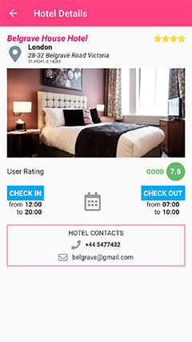

# lm_flutter

Flutter Application for Lastminute
Developed for Android and iOS

 
 
 
 
 

## Getting Started

This project is a starting point for a Flutter application.

Before you can build this project, you must install Flutter and configure your editor:

- [Flutter](https://flutter.dev/docs/get-started/install)
- [Android Studio] or [VisualStudio Code](https://flutter.dev/docs/get-started/editor)

For help getting started with Flutter, view online [documentation](https://flutter.dev/docs/get-started/install).

## Install PUBs

The most important plugins used in this project are : 

| Plugin  |  Pub | Used|
|---|---|---|
| [connectivity](https://pub.dartlang.org/packages/connectivity)|[](https://pub.dartlang.org/packages/connectivity)||
| [device_info](https://pub.dartlang.org/packages/device_info)|[](https://pub.dartlang.org/packages/device_info)||
| [package_info](https://pub.dartlang.org/packages/package_info)|[](https://pub.dartlang.org/packages/package_info)||
| [dio](https://pub.dartlang.org/packages/dio)|[](https://pub.dartlang.org/packages/dio)||
| [json_annotation](https://pub.dartlang.org/packages/json_annotation)|[](https://pub.dartlang.org/packages/json_annotation)||
| [cached_network_image](https://pub.dev/packages/cached_network_image)|[](https://pub.dartlang.org/packages/cached_network_image)||
| [carousel_slider](https://pub.dev/packages/carousel_slider)|[](https://pub.dartlang.org/packages/carousel_slider)||
| [json_serializable](https://pub.dartlang.org/packages/json_serializable)|[](https://pub.dartlang.org/packages/json_serializable)||

These plugins dependencies are defined inside the pubspec.yaml file, You can install these and others 
 - From the terminal: `Run flutter packages get`
 - From Android Studio/IntelliJ: Click ‘Packages Get’ in the action ribbon at the top of pubspec.yaml
 - From VS Code: Click ‘Get Packages’ located in right side of the action ribbon at the top of pubspec.yaml


## Run

You can run the main.dart file

- from the terminal `flutter run -t lib/main.dart`
- from IntelliJ click on the run button

## Brief Project Explaination

Starting form your specs I developed this small application.

The Project is sctuctured in this way : 
```bash
├── lib
    │
    ├── fragments        
    │   │
    │   ├── hotels 
    │   │    │
    │   │    ├── hotel_detail.dart                # detailed page for a selected Hotel
    │   │    │
    │   │    ├── hotel_ui_widget.dart             # ui definition for most component used in hotel_detail and hotels_fragment
    │   │    │  
    │   │    └── hotels_fragment.dart             # the fragment that contains the list of hotels sortable by user rating and by the numer of stars 
    │   │
    │   └── home_fragmet.dart                     # the main page that contains the menu drawer
    │
    ├── model                                     # classes definitions (Hotel, Location, Contact..)
    │
    ├── pages                                     # empty_page and splash_page
    │
    ├── rest              
    │   │
    │   └── hotel_rest_service.dart           
    │
    ├── ui                                        # usefull global definition 
    │
    ├── utils                                     # global usefull  
    │  
    └── main.dart
```

        

## TESTED ON :
- iOS Emulator : iphone 8
- Android Emulator : Nexus 5X with Android 9
- Real Device : Nexus 5X with Android 8.1
- Real Device : Redmi 4X with Android 7.1.2